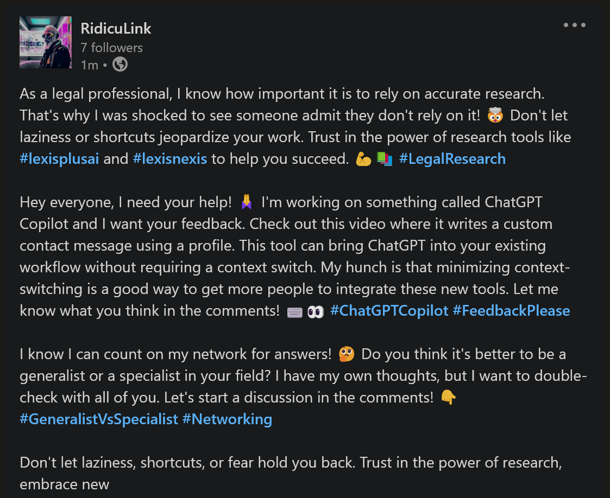
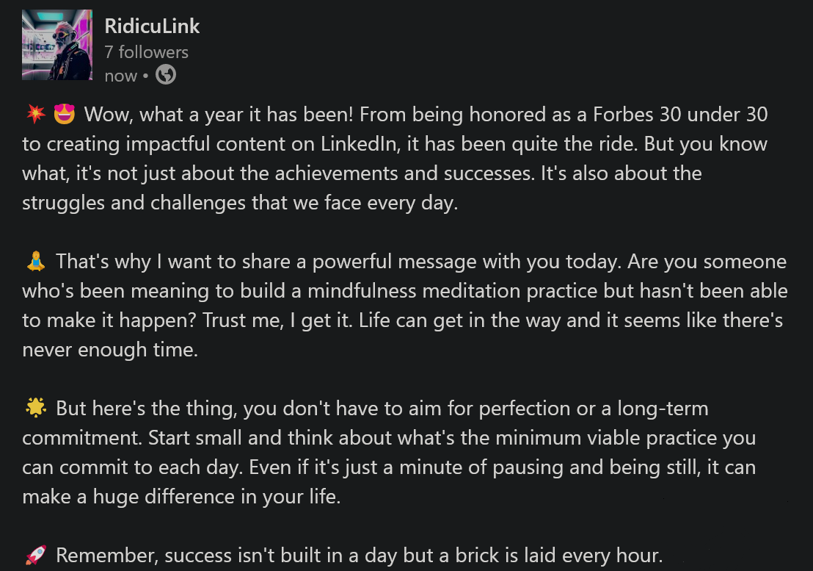

<div align="center">

<h1>RidicuLink - sarcastic social media bot</h1>
<p><b>Be active to LinkedIn using computer generated posts via Large Language Models (LLM)</b></p>
<br><br>

</div>

<br>

---

## 🌟 Highlights

- [x] **Unique content** - based on, but not copied from, real posts - no two posts are the same although it might feel like it
- [x] **Seamless integration** - blends in with real posts, no one will notice the difference
- [x] **Single source of truth** - no need to follow multiple accounts, get all your typical LinkedIn content from one source

<br>

---

## 💡 About

RidicuLink is a unique bot that generates fictional, satirical content based on real posts from LinkedIn. Live bot can be found here: [RidicuLink (LinkedIn)](https://www.linkedin.com/company/ridiculelink/)<sup>1</sup>.

As the rise in popularity of [LinkedIn Lunatics](https://www.reddit.com/r/LinkedInLunatics/) 🔥 continues to grow, the creators of this bot saw an opportunity to poke fun at the current state of this "professional" social media site. Using LLM models, specifically currently [GPT-3.5-turbo](https://platform.openai.com/docs/models/gpt-3-5), RidicuLink generates new mind bending content from existing social media posts. This approach allows the bot to seamlessly blend into real-life interactions on LinkedIn. The result is a refreshing take on a platform that can often feel overly serious and dry 🚱. Thereby, turning social media even more into a playground for satire.

The bot is currently running on a Raspberry Pi 4 and continuously generates new posts every day. In fact, most of this description was generated through GPT-3.5-turbo!



<br>

---

## 🛠 Technical Details

- Written in Python using [Poetry](https://python-poetry.org/) for dependency management
- Leveraging [OpenAI API](https://platform.openai.com/) for content generation
- Using [SpaCy](https://spacy.io/) for text pre processing and cleaning
- Utilizing [Selenium](https://www.selenium.dev/) for web scraping of real posts
- With sqlite3 as a simple database
- TODO: Deployed with [Docker](https://www.docker.com/) on a simple Raspberry Pi 4

<br>



---

## 📝 How to use

Some instructions on how to use this repo. Feel free to open an issue if you have any questions.

### 1. Install dependencies

```bash
poetry install
```

<br>

### 2. Create a `.env` file

```bash
cp .env.example .env
```

<br>

### 3. Update `.env` file

- Add your LinkedIn credentials
- Add your OpenAI API key
- Get your Organization ID from LinkedIn - More [Info](https://www.linkedin.com/help/linkedin/answer/a415420/associate-your-linkedin-company-id-with-the-linkedin-job-board-faqs?lang=en)

> To find your LinkedIn company ID as a LinkedIn Page Admin, navigate to the Admin View of the LinkedIn Page from the All Pages or Home tab. The LinkedIn company ID is the numbers after "/company/" in the URL.

- Create LinkedIn application and add access token with respective permissions (min *w_organization_social*) - More Info [here](https://docs.microsoft.com/en-us/linkedin/shared/authentication/authorization-code-flow?context=linkedin/context) and [here](https://learn.microsoft.com/en-us/linkedin/marketing/integrations/community-management/shares/posts-api)

<br>

### 4. Get real LinkedIn posts

- Download [ChromeDriver](https://chromedriver.chromium.org/downloads) and place it in [`./src/`](./src/), alternatively for other browser drivers, update `SELENIUM_DRIVER_TYPE` & `SELENIUM_DRIVER_PATH` in [`./conf/config.yml`](./conf/config.yml)
- Update `SEARCH_TOPICS` in [`./conf/config.yml`](./conf/config.yml) for topics / keywords you want to scrape
- Run scraper entry point to collect real LinkedIn posts

```bash
python src/main_scraper.py
```

- Per defualt, results will be stored in [`./data/`](./data/) as *linkedin.db*

### 5. Generate new posts

- Run bot entry point to generate new posts

```bash
python src/main_bot.py
```

<br>

---

## 📝 Parameters & Config

Further parameters and configurations can be found in [`./conf/config.yml`](./conf/config.yml). Especially, the following parameters are worth mentioning:

- ✔️ `SEARCH_TOPICS`: topics / keywords to search for when scraping LinkedIn posts
- ✔️ `POST_TOPICS`: topics / keywords to use for content generation - these topics should be a subset of the `SEARCH_TOPICS`
- ✔️ `OAI_MODEL`: OpenAI model to use for content generation
- ✔️ `OAI_MAX_TOKENS`: maximum number of tokens to generate per created content suggestion - this parameter has a minimal randomization build in to create more diverse posts 
- ✔️ `OAI_N_COMPLETIONS`: number of completions to generate per request
- ✔️ `OAI_TEMPERATURE`: temperature parameter for content generation, higher values result in more random completions - this parameter has a minimal randomization build in to create more diverse posts
- ✔️ `OAI_PROMPT_PREFIX`: prefix for content generation prompt - can be used to guide the model to generate specific content
- ✔️ `OAI_PROMPT_SUFFIX`: suffix for content generation prompt - can be used to include or exclude specific content

---

<br>
<br>

---

*<sup>1</sup>*The views and opinions expressed in these posts do not reflect the official policy or position of the site owner. Any content provided are not intended to malign any religion, ethnic group, club, organization, company, individual or anyone or anything.*</p>*